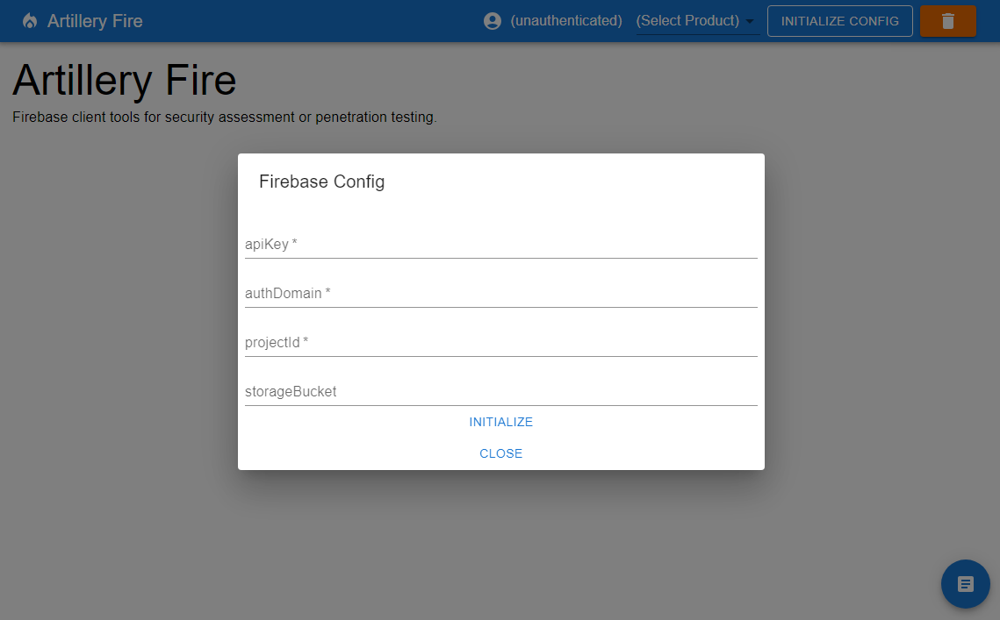
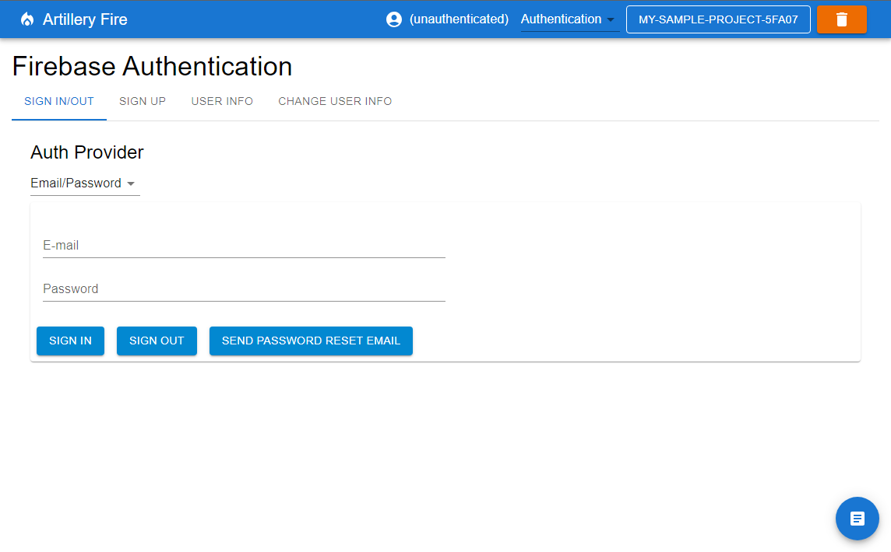
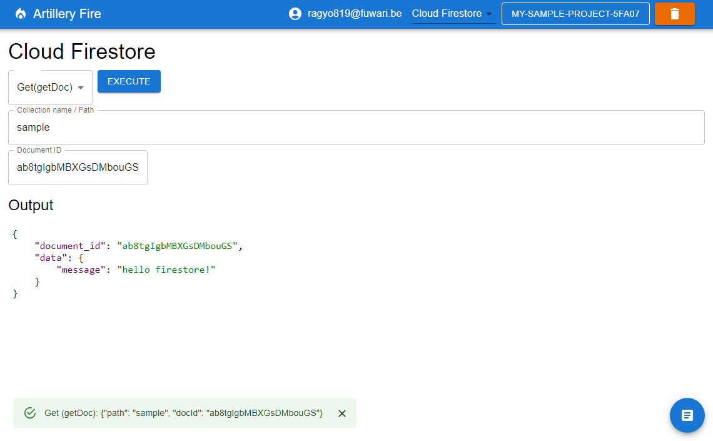
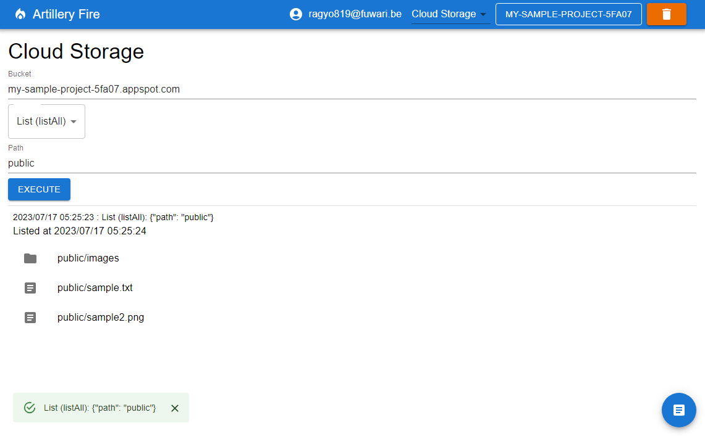
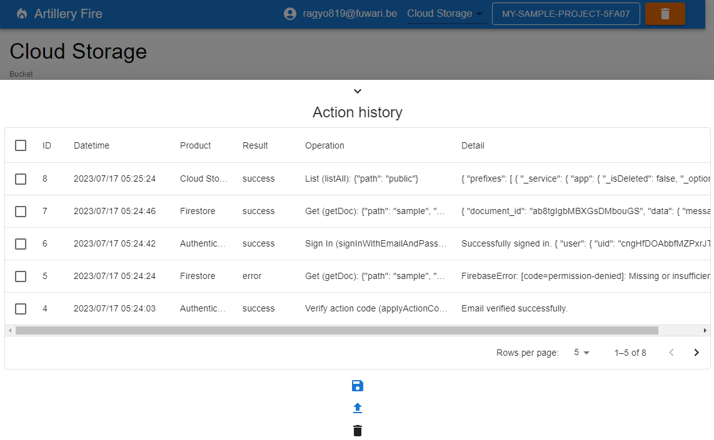

# Artillery Fire

It is a browser client tool of Firebase created for the purpose of being used for security diagnosis and penetration testing.
Since the author developed it while learning React, it is not a beautiful code, but please forgive me. I think that Firebase diagnosis is often done in a white box format, but if you try to do a comprehensive risk assessment, it will be necessary to actually do a PoC of the attack, so I think it would be good to use it in such a case.


## What this tool can do

- Various login/account management in Firebase Authentication
- Access to Cloud Firestore
- Access to Cloud Storage
- Record/view action history

> Note:
> I didn't implement Cloud Functions because it's actually a Web API. Please use BurpSuite or Postman.
> Also, for the same reason, we have not implemented access to the REST API for Authentication. (It is created for situations where it is faster or necessary to access using the SDK)


## Installation

- Requirements
  - node.js ver 19

```sh
git clone https://github.com/usk6666/ArtilleryFire.git
cd ArtilleryFire
npm install
npm start
```

or visit this URL: <https://usk6666.github.io/ArtilleryFire/>


## Screenshots








## Others

- Data such as action history is stored in localStorage
- Firestore makes it possible to forcibly solve with the eval function so that input data can handle Timestamp type. In the first place, it is a client for security diagnosis, and we do not accept indications such as XSS that should be fixed. (It is made after understanding the dangers such as XSS, so please use it.)


## License

This project is licensed under the MIT License, see the LICENSE file for details